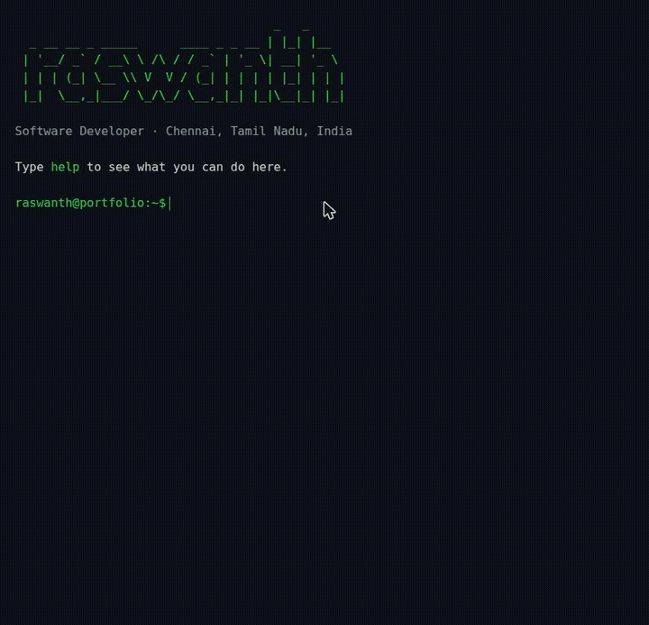

# Terminal Portfolio

A portfolio website that looks and behaves like a terminal. Visitors type
commands to explore — no menus, no scrolljacking, just a shell.

**Live:** https://sreehz.github.io/shell_portfolio/



## Commands

| Command | What it does |
| --- | --- |
| `help` | list available commands |
| `about` | who I am |
| `projects` | things I've built — `projects <name>` for details |
| `skills` | what I work with |
| `experience` | where I've worked |
| `education` | where I studied |
| `awards` | awards & certifications |
| `contact` / `socials` | how to reach me / find me elsewhere |
| `resume` | open my resume (PDF) |
| `theme <name>` | dark, light, dracula, gruvbox, matrix — persisted |
| `banner` / `clear` | show the welcome banner / clear the screen |

Plus the shell comforts: ↑/↓ command history, Tab autocompletion
(with common-prefix completion), Ctrl+L to clear, and "did you mean?"
suggestions for typos.

## How it's built

- **Vanilla TypeScript + Vite** — the terminal engine (input, output log,
  history, autocomplete) is custom-built in ~200 lines. No xterm.js,
  no frameworks. The whole site ships ~6 kB of gzipped JS.
- **Content as data** — everything the commands print lives in
  [`content/`](content/) as JSON. Updating the portfolio is a git commit.
- **GitHub Pages + Actions** — pushed to `main`, built, deployed. $0 hosting.
- **Each command is a module** in [`src/commands/`](src/commands/),
  registered in a central registry — adding a command is one new file.

Lighthouse: 100 / 100 / 100 / 100 (performance, accessibility,
best practices, SEO). Mobile gets tappable quick-command chips instead of
an auto-popping keyboard; animations respect `prefers-reduced-motion`.

## Development

```sh
npm install
npm run dev       # local dev server
npm run build     # type-check + production build to dist/
npm run preview   # serve the production build
```

Deployment is automatic: `.github/workflows/deploy.yml` builds and
publishes to GitHub Pages on every push to `main`.
